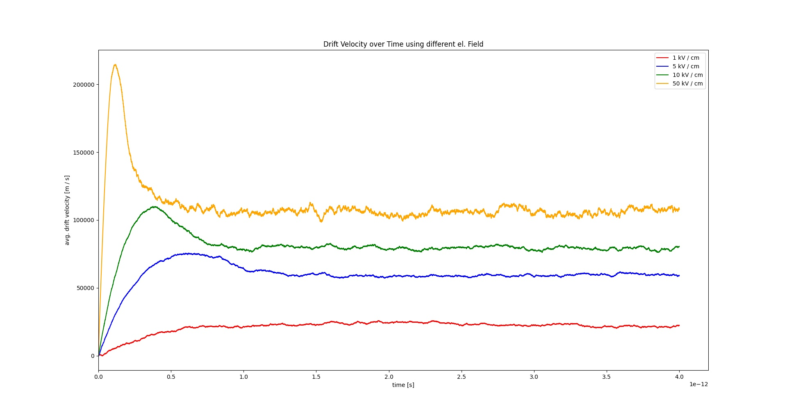
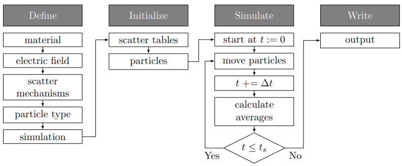

# Bulk Simulation Example
This example shows how to simulate bulk silicon with an applied background electric field.

The description of this example is organized as follows:

- **General Idea of Example**: This section describes the general idea of the example and ideas of what could be tested with that example.
- **Parameter of the Simulation**: This section describes the parameter of the simulation that can be customized.
- **Description of the Simulation Process**: This section describes the simulation process in more detail.
- **Output of the Simulation**: This section describes the output of this simulation and how it could be plotted.
- **References**: This section lists useful links for that example.

## General Idea
As already mentioned the general idea of that example is to simulate the electron transport characteristics behavior in bulk silicon with an applied constant electric "background" field.  The particle characteristics that are of interest in this kind of simulation are:

- the average drift velocity (velocity in the direction of the applied field) of the particles in each valley
- the average energy of the particles in each valley
- the percentage of particles that are present in each valley (valley occupation)

These average particle characteristics are calculated in each step and stored in seperate files in the end of the simulation.

Different things can be tested when adapting this example, either the effect of different electric field strengths or directions on the same material, the effect of different scatter mechanisms on the drift velocity or also the drift velocity for different materials.

As an example of what can be done with that simulation, the effect on the drift velocity of different electric fields using silicon and acoustic scattering and zero-order intervalley scattering is shown in the following:

    

 

## Customizable Parameters
Some of the parameters that are used and can be adapted are listed and described in the following.

###  Background Electric Field
The *background electric field* can be set via the parameter *appliedFieldStrength* and *appliedFieldDirection*. As the name of those parameter states, the first parameter sets the strength (norm) and the second the direction of the electric field. The parameter *appliedFieldDirection* doesn't have to be a unit vector, it is normalized later in the code.

### Material
The used material is defined by different constants. Additionally, the used material also determines the valleys (simplification of band structure) and the scatter mechanisms for that are applied within the simulation, but these characteristics are set for each used particle-type seperately (see  particleType).

### Geometry
The geometry is assumed to be a cuboid with one corner at the origin (0,0,0) and one corner at *maxPos*. Furthermore the vector *spacing* sets the spacing in each direction of the grid that represents the simulated geometry.

**Note:** In this example the geometry is required for the description of the simulation space. If a particle reaches the boundary of this space, periodic boundary conditions are assumed.

**Careful:** The number of used particles in the simulation is dependent on the geometry and the doping! To be more precise, the number of particles close to each grid point is calculated by multiplying the volume around each discrete grid point (defined by the spacing) and the doping at the point (see function getInitialNrParticles(..) of the used particle type). The particles are initialized like that to be consistent with the example [bulkSimulationFMM](../bulkSimulationFMM/).

### Particle Type
The particleType describes the simulated kind of particles (e.g electrons, holes, ...), see [ParticleType Implementation](../../include/ParticleType/). In this simulation only electrons are used as a particle type. The given particle type sets the mass and the charge of the particle type to the ones of an electron and determines that near each coordinate (grid point of the geometry grid described by the *maxPos* and *spacing*, see Geometry) the number of electrons should be determined with the given doping concentration.

For each moving particle type the dispersion relation must be defined; In this code this relation is described by valleys (approximation of the band structure - multi-valley approach, see [Valley Implementation](../../include/ValleyTypes/)). For each particle type each valley or group of valleys has to be added to the corresponding type, in this example only the X-valleys of silicon are added.

Also for each particle type all kinds of scattering events that can occur, have to be added for each region and each valley; In the example this is shown for acoustic and optical phonon scattering (see [ScatterMechanism Implementation](../../include/ScatterMechanisms/)).

### Simulation Parameter
The duration of the simulation is determined by *dt* (the time step) and *totalTime* (the total simulation time).

##  Simulation Description
The simulation consists of the following steps:

    

 

- **Define**: The user defines the required parameters, material and simulation characteristics. 
- **Initialize**: The scatter tables (pre-calculated scatter rates of all used mechanisms) and all particles are created. (**Note:** For the creation of the particles the parameter *maxPos*, *spacing* and *doping* are used. The geometry, in which the particles are placed (see Geometry) can be represented by a grid with the spacing *spacing*. For each coordinate (point in that grid), the number of particles that are expected near that coordinate is calculated and then the corresponding particles are created.  As already said this number can depend on *spacing*, *maxPos* and the *doping*, which is used for the comparison to example [bulkSimulationFMM](../bulkSimulationFMM/).)
- **Simulate**: In each simulation step the particles are moved based on the background electric field interrupted by scatter events. In each step also the ensemble averages of the characteristics of interest are calculated.
- **Write**: After the simulation is finished the resulting characteristics of interest are written to files as described in the next section.

## Output

The results are stored in multiple files:

- **prefix + AvgEnergy (+ parameter).txt**: This file contains at least two columns, the first one represents the time (in seconds) and the following ones represent the mean particle energy (in eV) in each valley.
- **prefix + AvgVelocity (+ parameter).txt**: This file contains at least two columns, the first one represents the time (in seconds) and the following ones represent the mean particle velocity in the direction of the applied electric field (in m/s).
- **prefix + valleyOccupation (+ parameter).txt**: This file contains at least two columns, the first one represents the time (in seconds) and the following ones represent the valley occupation percentage for each valley.

The file [plotBulkSimulationResults.py](plotBulkSimulationResults.py) shows how these resulting files can be plotted. For the usage of this file `emcPlottingFiles` has to be installed, as is described [here](../../README.md).

## References
- [Bulk Monte Carlo Lab:](https://nanohub.org/resources/bulkmc) Monte Carlo Bulk Simulation Tool, Fortran Code and Description. The Fortran Code was used for Comparison and Verification of the Results. Furthermore some descriptions can be found there to better understand the Bulk Simulation Code.

