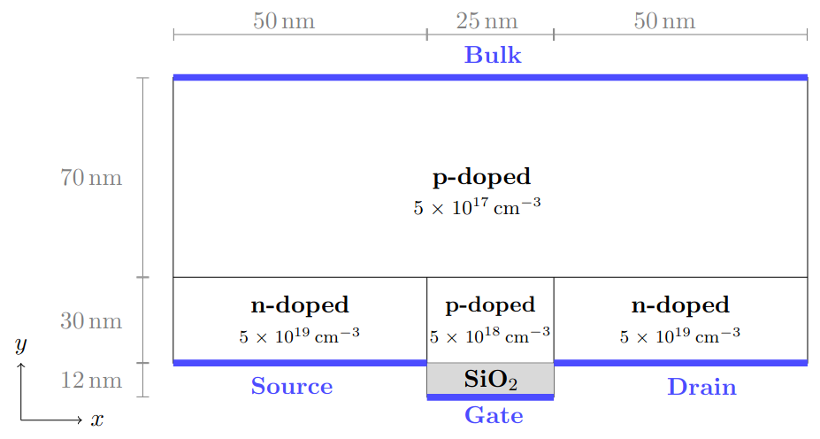
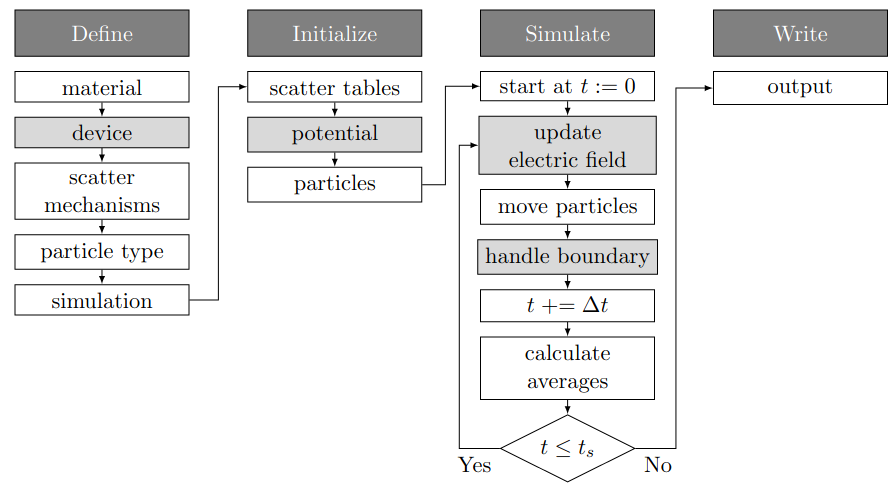

# MOSFET Example
This example shows how to simulate an n-channel MOSFET based on silicon. It is used to compare the results of this library to the ones from the classical ensemble Monte Carlo simulator (CEMC) in [ViennaWD](https://www.iue.tuwien.ac.at/software/viennawd/).

The structure of the simulated device is the same as the one from example1 of CEMC and can be seen in the following:

    

 

The description of this example is organized as follows:

- **General Idea of Example**: This section describes the general idea of the example and ideas of what could be tested with that example.
- **Parameter of the Simulation**: This section describes the parameter of the simulation that can be customized.
- **Description of the Simulation Process**: This section describes the simulation process in more detail.
- **Output of the Simulation**: This section describes the output of this simulation and how it could be plotted.
- **References**: This section lists useful links for that example.

## General Idea
As already mentioned the general idea of that example is to simulate an n-channel MOSFET, whose resulting characteristics can be compared to the simulations of [ViennaWD](https://www.iue.tuwien.ac.at/software/viennawd/).  The device characteristics that are of interest in this kind of simulation are:

- the potential distribution within the device
- the drain current
- the mean particle characteristics within the channel

The average characteristics of the potential and the current at each ohmic contact are calculated in each step after a transient time has passed and are stored in seperate files. Additionally, the initial (equilibrium) and final particle characteristics for are tracked and stored in files.

Different things can be studied when adapting this example:

- the effect of changes in the applied voltages
- the effect of a different material 
- the effect of variations in the device geometry or doping profile.
- effect of surface roughness at the interface between Si and SiO2.
 
## Customizable Parameters
The parameters that are used and can be adapted are listed and described in the following.

- **Applied Voltages:** The parameter *Vg* and *Vd* represent the applied voltages at the gate and drain contact, respectively.
- **Material:** As in the Bulk simulations example the used material can be changed, it is defined by different constants and also determines the valleys (simplification of band structure) and the scatter mechanisms for the moving particle types. These characteristics are set at the time the specific particle type is added.
- **Device:** The device geometry could be adapted by either extending *maxPos* of the device or changing the extent of the different doping regions. Additionally, also the doping concentrations in the device could be adapted.
- **Simulation Parameter:** The total duration of the simulation, the time-step and the transient time can be adapted in the step *param.setTimes(...)*. Moreover the used *PMScheme* and *solver* of the Poisson Equation could be adapted. 
- **Surface Roughness at Oxide Interface:** Surface Roughness at the interface between Si and SiO2 (at YMIN-boundary) can be added when *addRoughnessToOxideInterface* is set to *true*. Then the probability of specular surface scattering can be set with *probSpecularScattering*. If this parameter is 1, the surface is assumed to be smooth and only specular scattering is performed, if this parameter is 0, the surface is assumed to be rough and only diffuse scattering is performed at the interface. If the parameter is between 0 and 1 the parameter represents the probability of a specular scatter event to happen (if no specular event happens, the particle scatters diffusely).

##  Simulation Description
The simulation consists of the following steps:

    

 

- **Define**: The user defines the required parameters, device and simulation characteristics. 
- **Initialize**: The scatter tables (pre-calculated scatter rates of all used mechanisms), equilibrium potential and all particles are created.
- **Simulate**: In each simulation step the electric field is updated and the particles are moved based on the background electric field interrupted by scatter events. If a particle reaches a device boundary it is either reflected or if this boundary is an Ohmic contact deleted and counted as current. In each step also the ensemble averages of the characteristics of interest are calculated.
- **Write**: After the simulation is finished the resulting characteristics of interest are written to files as described in the next section.

**Note**: The grey fields in the given sketch are the steps that are required for device simulations but not for bulk simulations.

## Output

The results are stored in multiple files:

- **prefix (+ parameter) + potentialEq.txt**: This file contains the (initial) equilibrium potential in the device. First line represents the extent of the grid, then the potential at each point is written.
- **prefix (+ parameter) + EFieldXEq.txt**: This file contains the (initial) equilibrium EField in the X-direction. Same structure as previous file.
- **prefix (+ parameter) + EFieldYEq.txt**: This file contains the (initial) equilibrium EField in the Y-direction. Same structure as previous file.
- **prefix (+ parameter) + ElectronsConcEq.txt**: This file contains the (initial) equilibrium concentration of the electrsons at each grid point. Same structure as previous file.
- **prefix (+ parameter) + potentialAvg.txt**: This file contains the (final) average potential in the device. Same structure as previous file.
- **prefix (+ parameter) + ElectronsConcAvg.txt**: This file contains the (final) average concentration of the electrsons at each grid point. Same structure as previous file.
- **prefix (+ parameter) + ElectronsEq.txt**: This file contains the (initial) equilibrium characteristics of the simulated electrons. The first line represents the *maxPos* of the device and in the following each line represents the characteristics of one particle. 
- **prefix (+ parameter) + ElectronsFinal.txt**: This file contains the final characteristics of the simulated electrons. Same structure as previous file.

The file [plotMosfetResults.py](plotMosfetResults.py) shows how these resulting files can be plotted. For the usage of this file `emcPlottingFiles` has to be installed, as is described [here](../../README.md).

## References
- [ViennaWD:](https://www.iue.tuwien.ac.at/software/viennawd/) ViennaWD is a set of tools for various simulations written at the [Institute for Microelectronics](https://www.iue.tuwien.ac.at/home/). The Classical ensemble Monte Carlo Code ([CEMC](https://viennawd.sourceforge.net/viennawd-about-cemc.html)) was used for the comparison of the results of this example and was also the basis for the development of this code.
