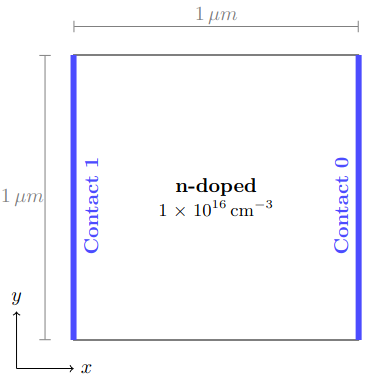

# Resistor2D Example
This example shows how to simulate a resistor. The structure of the simulated device can be seen in the following:

 

    

 

The description of this example is organized as follows:

- **General Idea of Example**: This section describes the general idea of the example and ideas of what could be tested with that example.
- **Parameter of the Simulation**: This section describes the parameter of the simulation that can be customized.
- **Description of the Simulation Process**: This section describes the simulation process in more detail.
- **Output of the Simulation**: This section describes the output of this simulation and how it could be plotted.

## General Idea
As already mentioned the general idea of that example is to simulate a resistor. The device characteristics that are of interest in this kind of simulation are the potential within the device and the current with different applied voltages.

The average characteristics of the potential and the current at each ohmic contact are calculated in each step after a transient time has passed and are stored in seperate files. Additionally, the initial (equilibrium) and final particle characteristics for are tracked and stored in files.

Different things can be studied when adapting this example:

- the effect of changes in the applied voltages
- the effect of a different material 
- the effect of variations in the device geometry or doping profile.
- the effect of grain scattering.
 
## Customizable Parameters
The parameters that are used and can be adapted are listed and described in the following.

- **Applied Voltages:** The parameter *appliedVoltages* represents the applied voltages at Contact 1 and can be adapted. 
- **Material:** As in the Bulk simulations example the used material can be changed, it is defined by different constants and also determines the valleys (simplification of band structure) and the scatter mechanisms for the moving particle types. These characteristics are set at the time the specific particle type is added.
- **Device:** The device geometry could be adapted by adapting *maxPos* of the device. Additionally, also the doping concentrations in the device could be adapted.
- **Simulation Parameter:** The total duration of the simulation, the time-step and the transient time can be adapted in the step *param.setTimes(...)*. Moreover the used *PMScheme* and *solver* of the Poisson Equation could be adapted. 
- **Grain Scattering:** Grain scattering can be added by setting *addGrainScattering* to *true*. A very simple grain scatter mechanism is implemented, that assumes that the rate at which particles scatter at grains is given (*grainScatterRate*) and the probability of the transmission of the particle (*transmissionProb*), these parameter can be adapted.   

##  Simulation Description

Same as described in [MOSFET Example](../mosfet2D/README.md).

## Output

The results are stored in multiple files:

- **prefix (+ parameter) + potentialEq.txt**: This file contains the (initial) equilibrium potential in the device. First line represents the extent of the grid, then the potential at each point is written.
- **prefix (+ parameter) + EFieldXEq.txt**: This file contains the (initial) equilibrium EField in the X-direction. Same structure as previous file.
- **prefix (+ parameter) + EFieldYEq.txt**: This file contains the (initial) equilibrium EField in the Y-direction. Same structure as previous file.
- **prefix (+ parameter) + ElectronsConcEq.txt**: This file contains the (initial) equilibrium concentration of the electrsons at each grid point. Same structure as previous file.
- **prefix (+ parameter) + potentialAvg.txt**: This file contains the (final) average potential in the device. Same structure as previous file.
- **prefix (+ parameter) + ElectronsConcAvg.txt**: This file contains the (final) average concentration of the electrsons at each grid point. Same structure as previous file.
- **prefix (+ parameter) + ElectronsEq.txt**: This file contains the (initial) equilibrium characteristics of the simulated electrons. The first line represents the *maxPos* of the device and in the following each line represents the characteristics of one particle. 
- **prefix (+ parameter) + ElectronsFinal.txt**: This file contains the final characteristics of the simulated electrons. Same structure as previous file.

The file [plotResistor2DResults.py](plotResistor2D.py) shows how these resulting files can be plotted. For the usage of this file `emcPlottingFiles` has to be installed, as is described [here](../../README.md).

